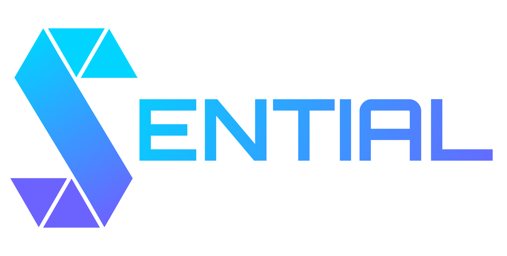

<div align="center">
<!-- Replace with your actual logo URL if hosted, or relative path -->


<p>
<strong>The Essential Guardian for Smart Contract Code.</strong>
</p>

<p>
<a href="https://sential-ai.onrender.com">Live Demo</a> •
<a href="#-installation">Installation</a> •
<a href="#-api-reference">API Docs</a> •
<a href="#-features">Features</a>
</p>

<p>


</p>
</div>

---

# 🟣 **Sential AI — v1.0**

### *Instant Smart Contract Pre-Flight Security Checks (Free & Open Source)*

Sential AI (v1.0) is an intelligent **“pre-flight check”** tool designed for Web3 developers.
Powered by **Google Gemini 1.5 Pro**, it performs instant, automated audits of Solidity smart contracts.

Built by **BlockVIA**, this version is **100% free & open source** — because basic security should be available to every builder shaping the decentralized future.

---

# 🚀 Why Sential v1.0?

Security shouldn’t be a luxury.

Sential v1.0 is built with one core mission:

> **Make high-quality security guidance accessible to every Web3 developer.**

---

## 🧭 Core Philosophy

### 🛡️ **Democratizing Trust**

Security tools should be free and accessible — from hackathon devs to founders.

### ⚡ **Instant Feedback**

Waiting weeks for an audit kills momentum.
Sential gives actionable insights **in seconds**, not days.

### 🧠 **Logic Over Syntax**

It's not a linter.
Sential understands the **intent** of your code to detect logical flaws.

### 📚 **Grow as a Developer**

Every audit includes explanations that help you become a stronger Solidity engineer.

---

# 🔮 Future Roadmap — Sential Pro (v2.0)

BlockVIA is building a next-generation, enterprise-grade automated auditor.

| Feature      | Sential v1.0 (Current) | Sential Pro (Upcoming)                   |
| ------------ | ---------------------- | ---------------------------------------- |
| **Access**   | Free & Open Source     | Paid / Subscription                      |
| **Engine**   | Gemini 1.5 Pro         | Claude + GPT-4 + Llama 3 Ensemble        |
| **Analysis** | Single Contract        | Full Repo / Dependency Graphs            |
| **Context**  | 1M Tokens              | Infinite Context (RAG + Vector DB)       |
| **Tools**    | Static Analysis        | Symbolic Execution + Formal Verification |

✨ **Sential v1.0 will always remain free.**
🔥 **Sential Pro v2.0 will redefine automated auditing.**

---

# ✨ Features (v1.0)

| Feature                      | Description                                                                     |
| ---------------------------- | ------------------------------------------------------------------------------- |
| 🔴 **Critical Detection**    | Detects reentrancy, overflow/underflow, access-control flaws, and logic errors. |
| 💰 **Gas Optimization**      | Suggests improvements to reduce gas usage.                                      |
| 📝 **Auto-Documentation**    | Generates or validates NatSpec comments.                                        |
| 📊 **Security Score**        | Rates contracts 0–10 based on risk factors.                                     |
| 🤖 **Smart Fallback System** | Automatically retries with Flash → Pro models for stability.                    |

---

# 🛠 Tech Stack

* **Frontend:** Vanilla JS, HTML5, TailwindCSS (CDN)
* **Backend:** Node.js, Express
* **AI Engine:** Google Gemini 1.5 Pro & Flash
* **Deployment:** Render (Web Service)
* **Markdown Rendering:** Marked.js

---

# ⚡ Installation (Local)

Follow these steps to run Sential AI locally.

---

## **1. Clone the Repository**

```bash
git clone https://github.com/grweb3/Sential-ai
cd sential-ai
```

---

## **2. Install Backend Dependencies**

Navigate into the backend folder:

```bash
cd backend
npm install
```

---

## **3. Configure Environment**

Create a `.env` file inside **backend/**:

```bash
touch .env
```

Add:

```
PORT=5000
GEMINI_API_KEY=your_actual_google_api_key_here
```

Get your key from **Google AI Studio**.

---

## **4. Run the Server**

```bash
npm start
```

Your server will run at:

```
http://localhost:5000
```

---

# 📖 API Reference

### **POST /api/analyze**

Analyze a Solidity smart contract string.

#### **Request Body**

```json
{
  "contractCode": "pragma solidity ^0.8.0; contract Example { ... }"
}
```

#### **Response**

```json
{
  "success": true,
  "modelUsed": "gemini-1.5-pro",
  "analysis": {
    "auditReport": {
      "score": 8.5,
      "critical": [],
      "high": []
    }
  }
}
```

---

# 🛡 Security Architecture

### **Smart Model Fallback**

Inside `backend/ai/analyze.js`, Sential automatically switches models if rate-limited:

1. `gemini-2.0-flash-exp` (Fastest)
2. `gemini-1.5-flash`
3. `gemini-1.5-pro` (Deepest reasoning)

### **API Key Protection**

* Keys are **server-only** (never sent to frontend)
* Environment variables via `.env`
* Rate limiting done server-side

---

# 📂 Project Structure

```
blockvia-sential/
├── backend/
│   ├── ai/
│   │   └── analyze.js       # AI Logic
│   ├── index.js             # Server Entry
│   └── node_modules/
├── frontend/
│   ├── index.html           # UI
│   ├── logo.png
│   └── video-bg.mp4
├── .env                     # Environment Variables (ignored)
├── .gitignore
├── package.json
└── README.md
```

---

# 🤝 Contributing

We welcome contributions!

1. **Fork** the repo
2. **Create a branch**

   ```bash
   git checkout -b feature/AmazingFeature
   ```
3. **Commit**

   ```bash
   git commit -m "Add AmazingFeature"
   ```
4. **Push**

   ```bash
   git push origin feature/AmazingFeature
   ```
5. **Open a Pull Request**

---

# 📄 License

Distributed under the MIT License.
See the `LICENSE` file for details.

---

<div align="center">
  <p>Built with ❤️ by <a href="https://blockvia.xyz">BlockVIA</a></p>
  <em>"Redefining trust in blockchain."</em>
</div>

---
